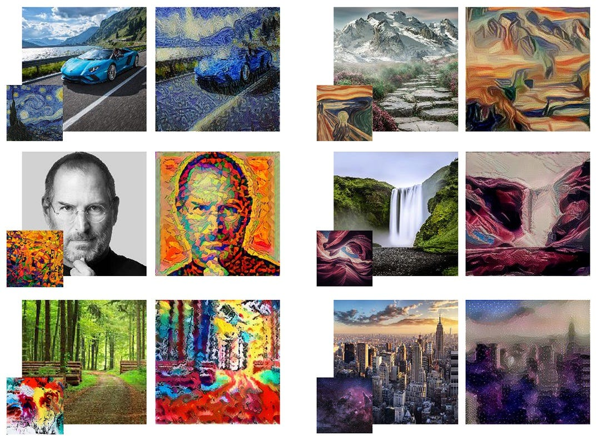

<i>**Note:** This project is still under development.</i>

# Artistic Vision :art: :eyes:

<u>**Artistic Vision**</u> is a Flask-based web application that brings the power of neural style transfer to your fingertips. Transform ordinary images into extraordinary pieces of art by applying the styles of famous paintings.


<p align="center">
   
   <br>
   <a src="https://towardsdatascience.com/light-on-math-machine-learning-intuitive-guide-to-neural-style-transfer-ef88e46697ee" target="_blank">Image Source</a>
</p>


<details>
   <summary>Repository Vision</summary>
   <p><br>
      The goal of this repository is to provide a simple and easy-to-use web application for neural style transfer. The application is built using the <a href="https://flask.palletsprojects.com/en/2.0.x/">Flask</a> framework and the <a href="https://pytorch.org/">PyTorch</a> library. The neural style transfer model is based on the [<a href="https://arxiv.org/abs/1508.06576">A Neural Algorithm of Artistic Style</a>] paper by Leon A. Gatys, Alexander S. Ecker, and Matthias Bethge. The model is trained on the [<a href="https://www.kaggle.com/c/painter-by-numbers">Painter by Numbers</a>] dataset from Kaggle. The dataset contains 103,250 paintings from 1,509 artists spanning over 500 years of art history. The model is trained on a subset of 10,000 images from the dataset. The model is trained on a GPU with the following specifications:<br>
      - Epochs: 10
      - Batch Size: 4
      - Loss (Training): 0.0001
      - Loss (Validation): 0.0002
   </p>
</details>

<details>
   <summary>Table of Contents</summary>
   <p>

   - [Artistic Vision](#artistic-vision-art-eyes)
      - [Features](#features)
      - [Getting Started](#getting-started)
         - [Prerequisites](#prerequisites)
         - [Installation](#installation)
      - [Contributing](#contributing)
      - [License](#license)
   </p>
</details>

## Features :sparkles:

- [x] Upload images from your device
- [x] Apply styles of famous paintings
   - [x] Upload your own style images
   - [x] Choose from a list of pre-loaded styles
- [x] Download the stylized image

## Getting Started :rocket:

#### Prerequisites :clipboard:

- Python 3.9 or higher
- pip
- virtual environment (optional)

#### Installation :computer:
```
# 1. Clone the repository
git clone https://github.com/yourusername/artistic-vision.git

# 2. Install the required packages
pip install -r requirements.txt

# 3. Run the application
python run.py
```

## Contributing :handshake:

Contributions are what make the open source community such an amazing place to learn, inspire, and create. Any contributions you make are **greatly appreciated**. Please refer to the [Contributing Guidelines](CONTRIBUTING.md) for more details.

## License :page_facing_up:

Distributed under the MIT License. See [LICENSE](LICENSE) for more information.