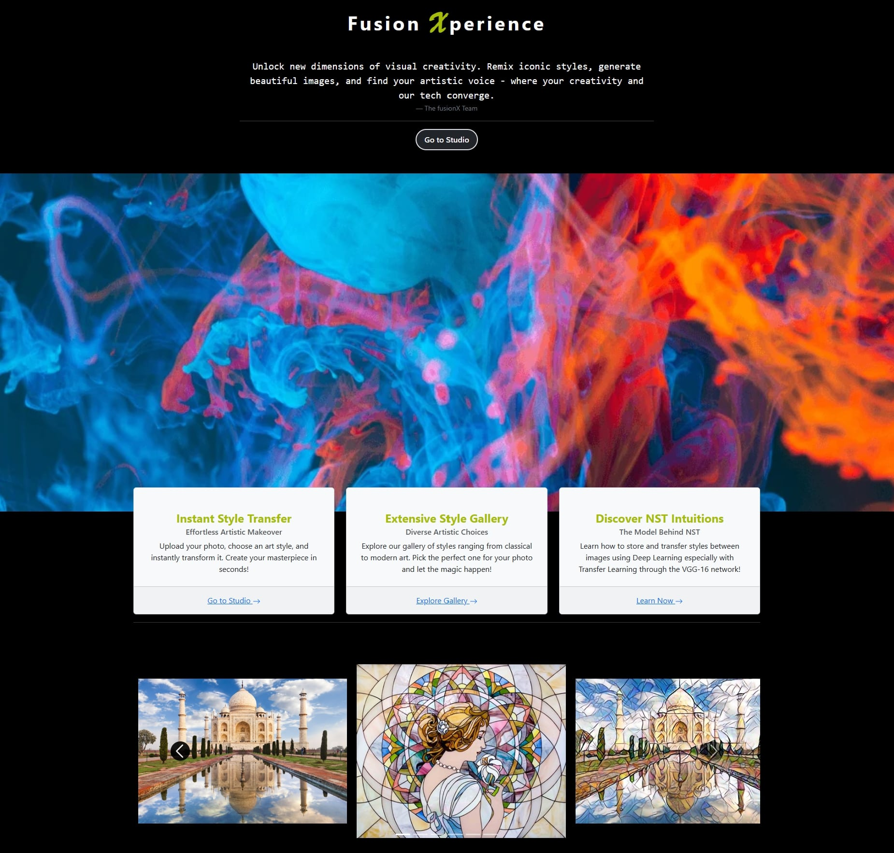
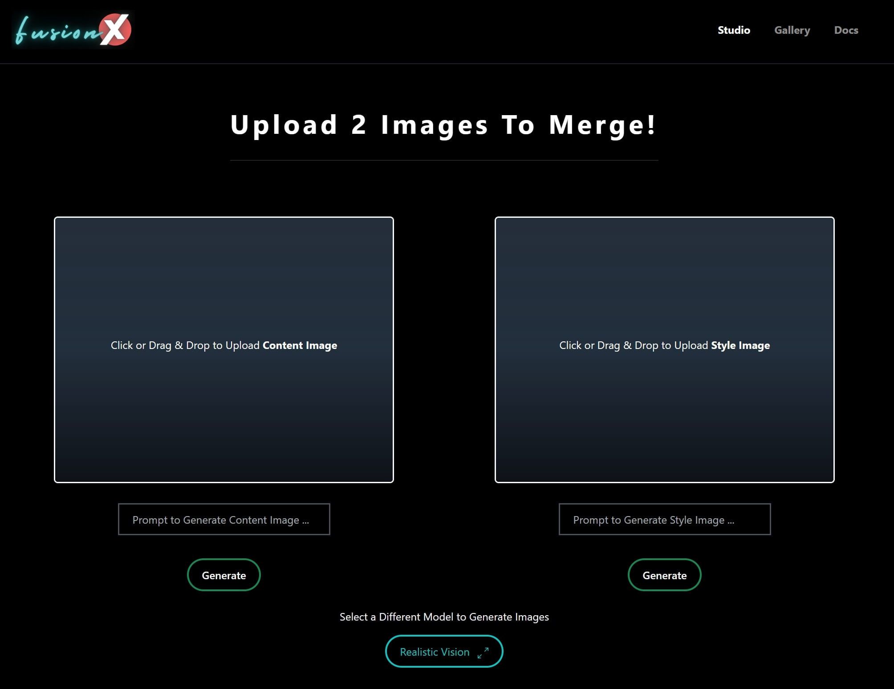
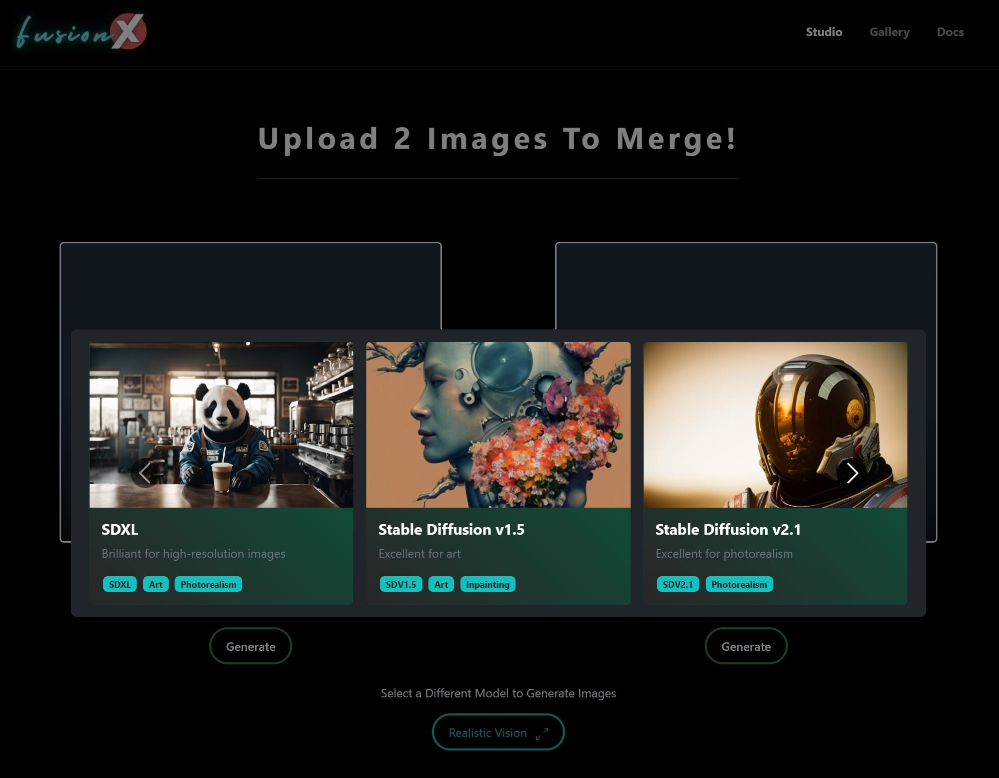
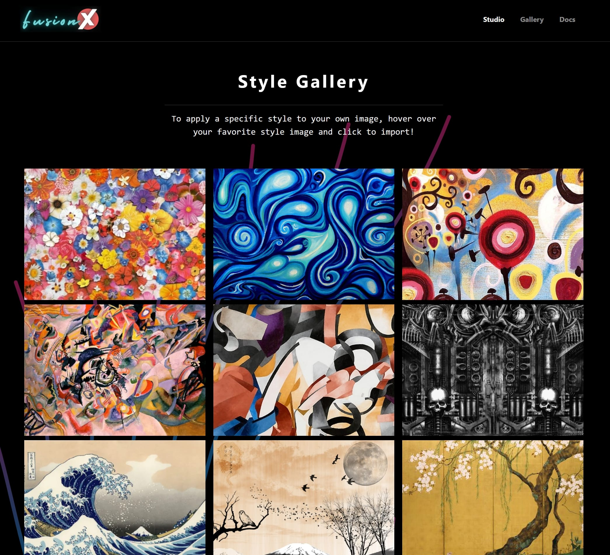
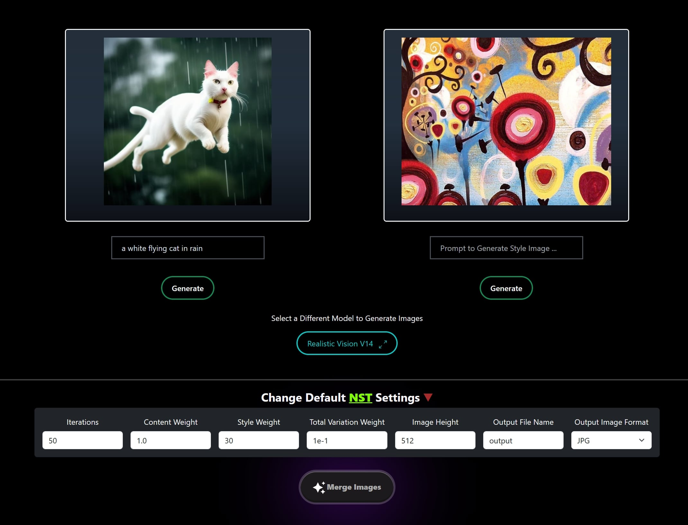

# Fusion Xperience :fire: :zap:

**FusionX** is a Flask-based web application that brings the power of neural style transfer to your fingertips. Transform ordinary images into extraordinary pieces of art by applying the styles of famous paintings.



## :sparkles: Repository Vision

The goal of this repository is to provide a simple and easy-to-use web application for neural style transfer. The application is built using the [Flask](https://flask.palletsprojects.com/en/2.0.x/) framework and the [PyTorch](https://pytorch.org/) library. The neural style transfer model is based on the [A Neural Algorithm of Artistic Style](https://arxiv.org/abs/1508.06576) paper by Leon A. Gatys, Alexander S. Ecker, and Matthias Bethge.

## :bookmark_tabs: Table of Contents

- [Features](#features-sparkles)
- [Application Preview](#application-preview-camera)
- [Getting Started](#getting-started-rocket)
  - [Prerequisites](#prerequisites-clipboard)
  - [Environment Variables](#environment-variables-key)
  - [Installation](#installation-computer)
- [Contributing](#contributing-handshake)
- [License](#license-page_facing_up)

## Features :sparkles:

- Upload or Generate content images
  - Upload from your device
  - Generate using Hugging Face Text-to-Image API
- Apply styles to content images
  - Upload from your device
  - Choose from a gallery of pre-loaded styles
  - Generate using Hugging Face Text-to-Image API
- Customize the style transfer process with advanced options
  - Adjust the style weight
  - Adjust the content weight
  - Adjust the total variation weight
  - Adjust the number of iterations
- Use the Editor to fine-tune the stylized image
  - Crop and Resize the image
  - Super Resolution using Real-ESRGAN
- Download the stylized image

## Application Preview :camera:

<table align="center" style="border-collapse: collapse; width: 100%;" cellpadding="0" cellspacing="0">
    <tr>
        <td align="center" style="padding: 10px; width: 50%;">
            <p><i>The Studio page allows you to upload content and style images.</i><br><br>
            </p>
        </td>
        <td align="center" style="padding: 10px; width: 50%;">
            <p><i>The Studio page also allows you to generate content and style images using the Hugging Face Text-to-Image API.</i><br><br>
            </p>
        </td>
    </tr>
    <tr>
        <td align="center" style="padding: 10px; width: 50%;">
            <p><i>The Gallery page showcases a collection of pre-loaded style images that can be applied to your content images.</i><br><br>
            </p>
        </td>
        <td align="center" style="padding: 10px; width: 50%;">
            <p><i>Once both the content and style images are selected, you can customize the style transfer process using advanced options.</i><br><br>
            </p>
        </td>
    </tr>
    <tr>
        <td colspan="2" align="center" style="padding: 10px;">
            <p><i>The Editor page allows you to fine-tune the stylized image by cropping, resizing, and enhancing the image.</i><br><br>
            </p>
        </td>
    </tr>
</table>


## Getting Started :rocket:

#### Prerequisites :clipboard:

- Python 3.9 or higher
- Torch

#### Environment Variables :key:

Create a `.env` file in the root directory of the project and add the following environment variables:

```python
SECRET_KEY="your_secret_key"
HF_API_KEY="your_hugging_face_api_key"

# Hugging Face Text-to-Image API Models that fusionX uses
STABLE_DIFFUSION_V15="https://api-inference.huggingface.co/models/runwayml/stable-diffusion-v1-5"
STABLE_DIFFUSION_V21="https://api-inference.huggingface.co/models/stabilityai/stable-diffusion-2-1"
STABLE_DIFFUSION_XL_BASE_1.0="https://api-inference.huggingface.co/models/stabilityai/stable-diffusion-xl-base-1.0"
ANYTHING_V5="https://api-inference.huggingface.co/models/stablediffusionapi/anything-v5"
DREAMLIKE_PHOTO_REAL="https://api-inference.huggingface.co/models/dreamlike-art/dreamlike-photoreal-2.0"
DREAM_SHAPER="https://api-inference.huggingface.co/models/Lykon/DreamShaper"
NITRO_DIFFUSION="https://api-inference.huggingface.co/models/nitrosocke/Nitro-Diffusion"
DREAMLIKE_ANIME_V10="https://api-inference.huggingface.co/models/dreamlike-art/dreamlike-anime-1.0"
REALISTIC_VISION_V14="https://api-inference.huggingface.co/models/SG161222/Realistic_Vision_V1.4"
```

#### Installation :computer:
```
# 1. Clone the repository
git clone https://github.com/yourusername/fusionX.git

# 2. Navigate to the project directory
cd fusionX

# 3. Create a virtual environment (optional)
python -m venv venv

# 4. Activate the virtual environment
source venv/bin/activate

# 5. Install the required packages
pip install -r requirements.txt

# 6. Run the application
python run.py
```

## Contributing :handshake:

Contributions are what make the open source community such an amazing place to learn, inspire, and create. Any contributions you make are **greatly appreciated**. Please refer to the [Contributing Guidelines](CONTRIBUTING.md) for more details.

## License :page_facing_up:

Distributed under the MIT License. See [LICENSE](LICENSE) for more information.
