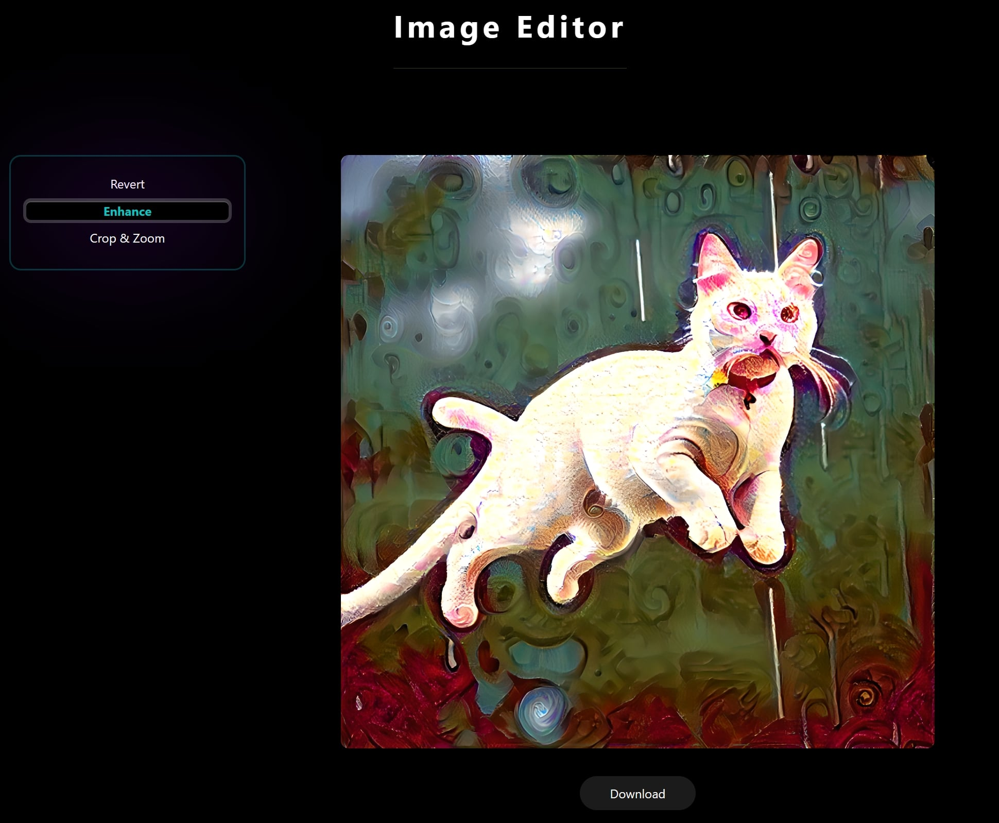

# Fusion Xperience :fire: :zap:

<u>**FusionX**</u> is a Flask-based web application that brings the power of neural style transfer to your fingertips. Transform ordinary images into extraordinary pieces of art by applying the styles of famous paintings.


<p style="text-align: center;">
   
   <br>
   <a href="https://towardsdatascience.com/light-on-math-machine-learning-intuitive-guide-to-neural-style-transfer-ef88e46697ee" target="_blank">Image Source</a>
</p>


<details>
   <summary>Repository Vision</summary>
   <p><br>
      The goal of this repository is to provide a simple and easy-to-use web application for neural style transfer. The application is built using the <a href="https://flask.palletsprojects.com/en/2.0.x/">Flask</a> framework and the <a href="https://pytorch.org/">PyTorch</a> library. The neural style transfer model is based on the [<a href="https://arxiv.org/abs/1508.06576">A Neural Algorithm of Artistic Style</a>] paper by Leon A. Gatys, Alexander S. Ecker, and Matthias Bethge.<br>
   </p>
</details>

<details>
   <summary>Table of Contents</summary>
   <p>

   - [FusionX](#artistic-vision-art-eyes)
      - [Features](#features)
      - [Application Preview](#application-preview)
      - [Getting Started](#getting-started)
         - [Prerequisites](#prerequisites)
         - [Installation](#installation)
      - [Contributing](#contributing)
      - [License](#license)
   </p>
</details>

## Features :sparkles:

- [x] Upload or Generate content images
   - [x] Upload from your device
   - [x] Generate using Hugging Face Text-to-Image API
- [x] Apply styles to content images
   - [x] Upload from your device
   - [x] Choose from a gallery of pre-loaded styles
   - [x] Generate using Hugging Face Text-to-Image API
- [x] Customize the style transfer process with advanced options
   - [x] Adjust the style weight
   - [x] Adjust the content weight
   - [x] Adjust the total variation weight
   - [x] Adjust the number of iterations
- [x] Use the Editor to fine-tune the stylized image
   - [x] Crop and Resize the image
   - [x] Super Resolution using Real-ESRGAN
- [x] Download the stylized image

## Application Preview :camera:

<p style="text-align: center;">
The FusionX web application is live at <a href="https://fusionx.herokuapp.com/">https://fusionx.herokuapp.com/</a> <br>
   
</p>

<p style="text-align: center;">
The Studio page allows you to upload content and style images. <br>
   
</p>

<p style="text-align: center;">
The Studio page also allows you to generate content and style images using the Hugging Face Text-to-Image API. <br>
   
</p>

<p style="text-align: center;">
The Gallery page showcases a collection of pre-loaded style images that can be applied to your content images. <br>
   
</p>

<p style="text-align: center;">
Once both the content and style images are selected, you can customize the style transfer process using advanced options. <br>
   
</p>

<p style="text-align: center;">
The Editor page allows you to fine-tune the stylized image by cropping, resizing, and enhancing the image. <br>
   
</p>


## Getting Started :rocket:

#### Prerequisites :clipboard:

- Python 3.9 or higher
- Torch

#### Installation :computer:
```
# 1. Clone the repository
git clone https://github.com/yourusername/fusionX.git

# 2. Navigate to the project directory
cd fusionX

# 3. Create a virtual environment (optional)
python -m venv venv

# 4. Activate the virtual environment
source venv/bin/activate

# 5. Install the required packages
pip install -r requirements.txt

# 6. Run the application
python run.py
```

## Contributing :handshake:

Contributions are what make the open source community such an amazing place to learn, inspire, and create. Any contributions you make are **greatly appreciated**. Please refer to the [Contributing Guidelines](CONTRIBUTING.md) for more details.

## License :page_facing_up:

Distributed under the MIT License. See [LICENSE](LICENSE) for more information.
